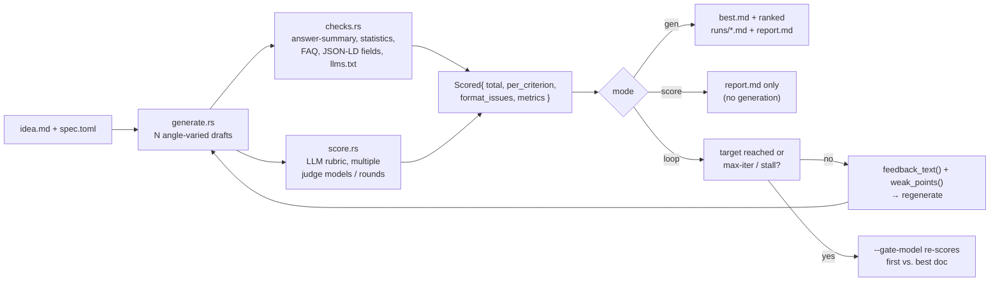
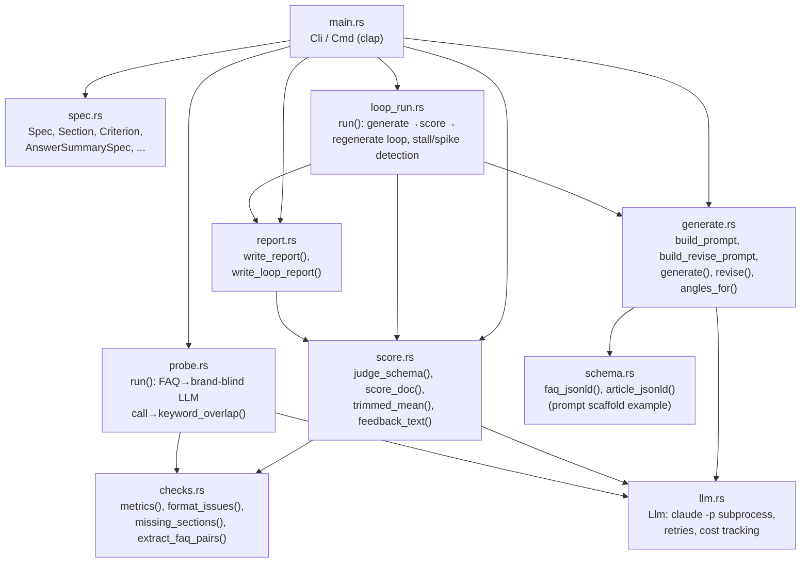
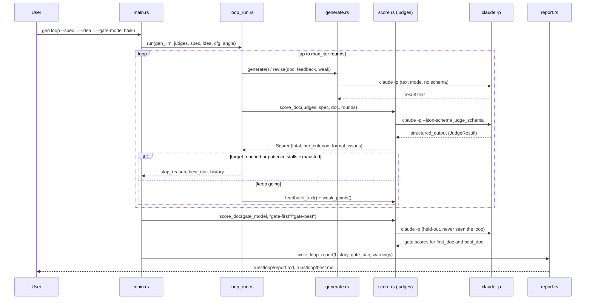
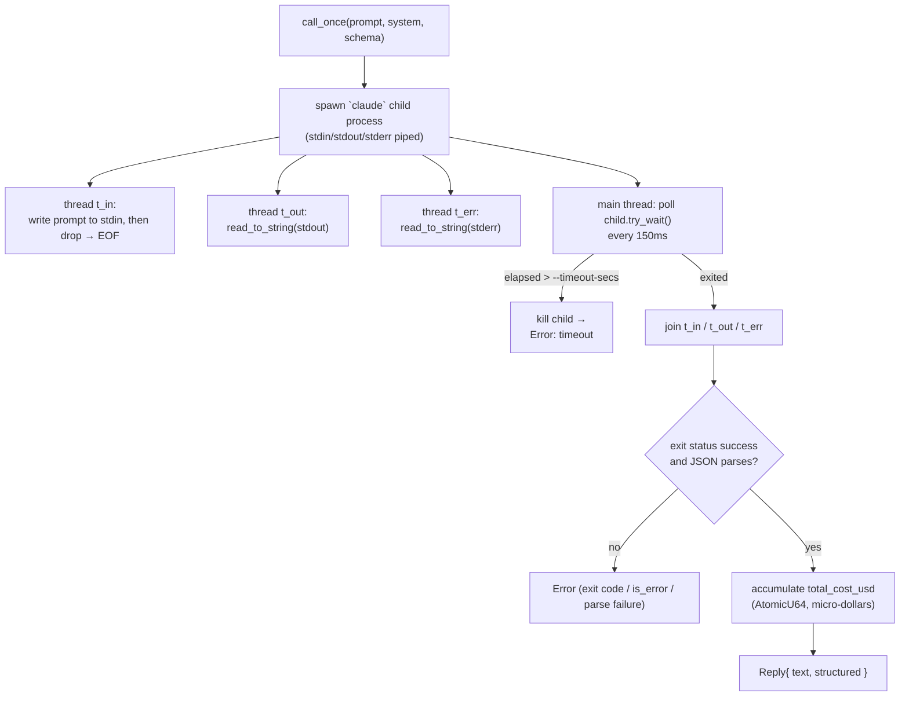
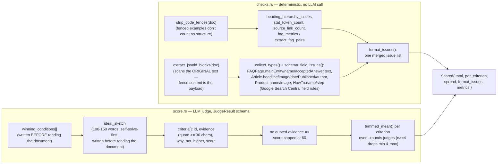
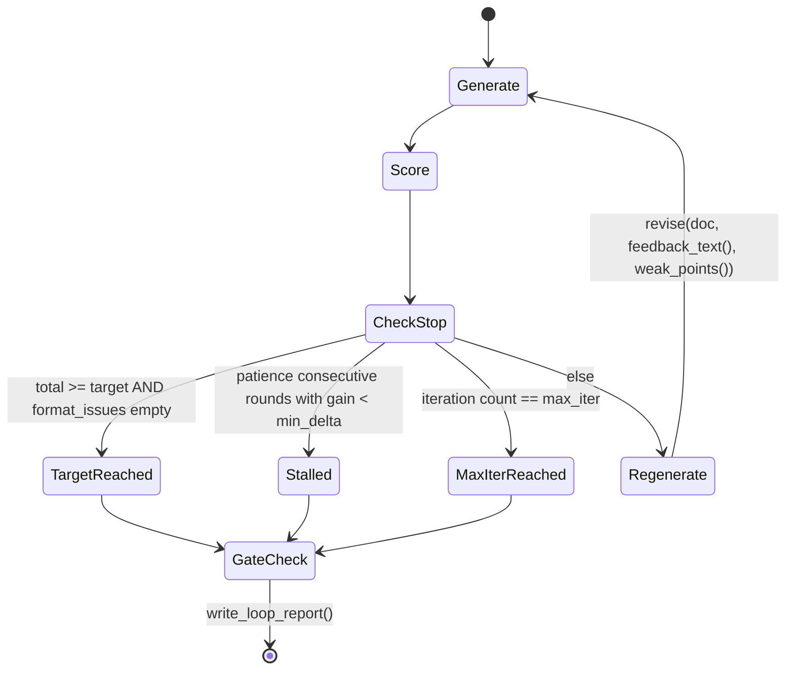
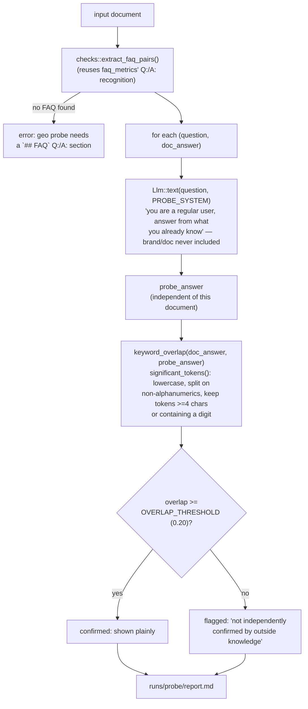

# geo-loop

`geo-loop` is a Rust CLI for **GEO (Generative Engine Optimization)**: writing content structured so that generative answer engines — ChatGPT, Perplexity, Google AI Overviews — can cite or extract it directly. The binary is called `geo`.

It runs a **generate → deterministically check → LLM-judge score → regenerate** loop over a single document, using the **Claude Code CLI (`claude -p`) as a subprocess backend** — no separate LLM API key is required, only a logged-in `claude` CLI.

The CLI structure, the `claude -p` subprocess backend (`src/llm.rs`), the loop/gate logic (`src/loop_run.rs`), and the report format (`src/report.rs`) are a direct port of [`Loop-Suite/bizplan-loop`](https://github.com/Loop-Suite/bizplan-loop)'s architecture into the GEO domain (see `NOTICE`): independent multi-round judging, trimmed-mean aggregation, a held-out gate model, and a self-improvement loop, all applied here to "will a generative answer engine cite this document" instead of business-plan review.

## Contents

- [What it evaluates](#what-it-evaluates)
- [Pipeline overview](#pipeline-overview)
- [Architecture](#architecture)
- [CLI](#cli)
- [Backend: `claude -p` as a subprocess](#backend-claude--p-as-a-subprocess)
- [Deterministic checks vs. LLM judgment](#deterministic-checks-vs-llm-judgment)
- [Self-improvement loop (`geo loop`)](#self-improvement-loop-geo-loop)
- [`geo probe`: a brand-blind cross-check](#geo-probe-a-brand-blind-cross-check)
- [Spec file (`specs/*.toml`)](#spec-file-specstoml)
- [Build](#build)
- [Attribution](#attribution)
- [Empirical review findings](#empirical-review-findings)
- [Limitations](#limitations)

## What it evaluates

A document handled by `geo-loop` is scored and generated against four structural requirements, all defined per-document in a spec TOML (`spec.rs`) and enforced two ways — written into the generation prompt (`generate.rs::structure_requirements()`) and checked deterministically afterward (`checks.rs`):

| Requirement | Default | Enforced by |
|---|---|---|
| **Direct-answer opening** | First paragraph after the H1, ≤60 words, answers the core question | `checks::answer_summary_issues` |
| **Sourced statistics** | ≥2 numeric statistics, each backed by a Markdown link | `checks::statistics_issues` |
| **FAQ block** | ≥3 `Q:`/`A:` pairs under an `## FAQ` heading | `checks::faq_issues` |
| **Structured data (JSON-LD)** | A trailing ` ```json ` block with required `@type`s (default `Article`, `FAQPage`) and their required/recommended fields | `checks::structured_data_issues` / `schema_field_issues` |
| **`llms.txt` snippet** (optional) | A separate ` ```llms.txt ``` ` block: H1, blockquote summary, link list | `checks::llms_txt_issues` |

The rubric score itself (0–100) is a weighted sum of spec-defined criteria — the bundled example spec (`specs/example-article.toml`) uses `citability` 30%, `extractability` 25%, `authority_signal` 25%, `entity_clarity` 20%.

## Pipeline overview



## Architecture

`src/main.rs` parses the CLI (`clap`) and wires the other nine modules together. Nothing here is a guess — this mirrors the actual `mod` declarations and call graph in `main.rs`:



## CLI

Global flags (apply to every subcommand, defined once on `Cli`):

| Flag | Default | Meaning |
|---|---|---|
| `--claude-bin` | `claude` | Path to the `claude` executable |
| `--model` | — | Generation model (`opus`/`sonnet`/`haiku`/`fable` or a full model ID) |
| `--judge-model` | — | Judge model(s); comma-separated for a rotating panel (e.g. `sonnet,haiku`). If unset, the generation model also judges (a warning is printed) |
| `--retries` | `2` | Retries per LLM call |
| `--timeout-secs` | `600` | Timeout per LLM call |
| `--max-budget-usd` | — | Passed to `claude --max-budget-usd` |
| `--load-context` | off | Load the working directory's `CLAUDE.md`/plugins/hooks (disables `--safe-mode`) |
| `--verbose` | off | Print retry/failure logs |

Subcommands (`src/main.rs::Cmd`):

```bash
# 1) generate N drafts, score, and rank them
geo --model sonnet --judge-model haiku \
  gen --spec specs/example-article.toml --idea idea.md \
      -n 6 --rounds 2 --concurrency 3 --out runs/article
# -n/--count default 3, --rounds (alias --judges) default 2, --concurrency default 1
# --no-score skips scoring and only writes cand01.md.. candNN.md

# 2) score an existing document (or a directory of .md/.txt files) — no generation
geo --judge-model sonnet,haiku \
  score --spec specs/example-article.toml --input my-article.md \
        --rounds 3 --out runs/check

# 3) self-improvement loop toward a target score, with a held-out sanity check
geo --model opus --judge-model sonnet --gate-model haiku \
  loop --spec specs/example-article.toml --idea idea.md \
       --target 85 --max-iter 4 --min-delta 2.0 --patience 2 --out runs/loop
# target default 85.0, max-iter default 4, min-delta default 2.0, patience default 2

# 4) brand-blind cross-check of an existing document's FAQ claims
geo probe --spec specs/example-article.toml --input my-article.md --out runs/probe
```

### Sequence: `geo loop --gate-model ...`



## Backend: `claude -p` as a subprocess

`llm.rs::Llm::call_once` shells out to the Claude Code CLI. The invocation shape (verified against `claude --help`, per the in-code doc comment) is:

```
claude -p --output-format json --no-session-persistence --tools "" \
       [--safe-mode] [--model M] [--max-budget-usd X] \
       [--append-system-prompt S] [--json-schema SCHEMA]
```

| Flag | Reason |
|---|---|
| `--safe-mode` | Skip the working directory's `CLAUDE.md`/skills/plugins/hooks/MCP → reproducibility. Off when `--load-context` is passed |
| `--tools ""` | Fully disables built-in tools (Read/Edit/Write/Bash) → pure text generation, no file access |
| `--no-session-persistence` | No session file is written — avoids contention under `--concurrency > 1` |
| `--output-format json` | Response carries `result` / `structured_output` / `total_cost_usd` / `is_error` |
| `--json-schema` | Used only for judging; the judge's structured `JudgeResult` arrives in `structured_output` |

Note: `--bare` is deliberately not used — it skips OAuth/keychain lookup and breaks auth for subscription-login users (per the in-code comment).

The prompt is written to the child's stdin and stdout/stderr are drained on separate threads concurrently with the write, to avoid a deadlock from a filled pipe buffer:



Retries (`--retries`, default 2) wrap `call_once` at the `text()`/`json()` level. `json()` first tries the CLI's `structured_output`; if that's absent it falls back to `extract_json()`, which strips fenced code blocks or takes the outermost `{...}` span from the raw text.

## Deterministic checks vs. LLM judgment

The design deliberately keeps two separate paths, based on the idea that the evaluation-cost hierarchy runs *assertion/rule → LLM judge* — cheap, deterministic checks are never left to the LLM:



`score.rs::LENSES` rotates six judging perspectives across rounds (overall balance, first-paragraph-only extractability, statistic/source verifiability, heading/FAQ parser-friendliness, entity clarity, competitive differentiation), and `--judge-model a,b` rotates models the same way — `score_doc` cycles `judges[i % judges.len()]` and `LENSES[i % LENSES.len()]` per round. Repeating one model N times produces correlated error, so mixing models is the only way to get an actually-independent panel.

Per-criterion `spread` (max − min across rounds) is reported alongside the score as an instability signal — a wide spread on a criterion means don't trust that number.

## Self-improvement loop (`geo loop`)



Two safety signals are computed purely from already-collected scores (no extra API calls):

- **Stall-then-spike warning**: if ≥2 consecutive rounds improved by less than `--min-delta`, immediately followed by a round that gains ≥3× `--min-delta`, the report flags a possible reward-hacking pattern (based on arXiv:2606.04923's stall-then-spike observation) and points at the held-out gate result.
- **Length-inflation canary**: if document length grows >25% from first to best draft while the score gain is <5 points, the report flags likely "padding" rather than substantive improvement.

The `--gate-model` (never part of the loop's judge panel) re-scores only `first_doc` and `best_doc` after the loop ends. If the loop-measured gain is real, the held-out gain should track it; `report.rs::write_loop_report` explicitly warns when the held-out gain is under a third of the loop-measured gain.

## `geo probe`: a brand-blind cross-check

A minimal, deterministic-comparison version of the "fresh, brand-blind subagent probe" idea, reusing the same `claude -p` backend with no new API surface — it does **not** prove a real search engine would cite the document; it's a rough proxy for how much a document's FAQ claims overlap with generic, brand-blind knowledge.



Explicit limitation carried into the report itself: low overlap doesn't mean a claim is wrong (it may be exactly what differentiates the document), and high overlap doesn't guarantee an engine would actually cite it — treat it only as a cheap pre-publish sanity signal.

## Spec file (`specs/*.toml`)

`specs/example-article.toml` is the bundled example (`spec.rs::Spec`, loaded/validated by `Spec::load`, which rejects empty `criteria`, non-positive weights, duplicate criterion IDs, and empty `structured_data.required_types`):

```toml
name = "Product/service intro GEO article (example spec)"
context = "... inserted verbatim into every generation/judge prompt ..."
total_words = 900

[[sections]]
id = "overview"
title = "Overview"
guide = "Define the core entity unambiguously; state who it's for"
words = 200
required = true

[[criteria]]
id = "citability"
name = "Citability"
weight = 30
guide = "Can the first sentence/paragraph alone be quoted as the answer?"

[answer_summary]
max_words = 60
required = true

[statistics]
min_count = 2
require_sourced = true

[faq]
min_qa = 3
require_faqpage = true

[structured_data]
required_types = ["Article", "FAQPage"]

[llms_txt]
enabled = true
```

For real use: copy the file, fill in the actual topic/audience/verified statistics as `idea.md`, and adjust `criteria` weights and `sections` to the target content type. `idea.md` is not a template — it's the source-of-truth material; if the model invents numbers that aren't in it, `authority_signal` is penalized directly.

## Build

```bash
cargo build --release   # target/release/geo
```

Requirements: Rust 1.70+, and the `claude` CLI installed and logged in (`--claude-bin` if it's not on `PATH`).

Each module carries its own unit tests (`cargo test`) — 16 in `checks.rs` covering fence-stripping, heading hierarchy, FAQ parsing, and the FAQPage/Article/Product/HowTo field checks, plus tests in `score.rs` (trimmed-mean outlier handling), `probe.rs` (overlap edge cases), and `schema.rs` (JSON-LD `@type` shape).

## Attribution

Full detail in `NOTICE`. Summary:

- **Architecture** (CLI shape, `claude -p` subprocess backend, loop/gate logic, report format) ported from [`Loop-Suite/bizplan-loop`](https://github.com/Loop-Suite/bizplan-loop) (Apache-2.0) into the GEO domain.
- **[Auriti-Labs/geo-optimizer-skill](https://github.com/Auriti-Labs/geo-optimizer-skill)** (MIT) — `checks::llms_txt_issues()` reimplements that repo's `audit_llms.py::_validate_llms_content()` judgment logic (H1-first-line, blockquote summary, Markdown link, minimum length) in Rust, rewritten to this project's data structures rather than transliterated.
- **[ai-search-guru/getcito](https://github.com/ai-search-guru/getcito-worlds-first-open-source-aio-aeo-or-geo-tool)** (MIT) — `schema.rs`'s `faq_jsonld()`/`article_jsonld()` reimplement that repo's `seo.ts::faqJsonLd()`/`articleJsonLd()` field structure, used only as the example JSON-LD scaffold shown inside the generation prompt.
- **Google Search Central structured-data guidelines** (documentation, not code) — the FAQPage/Article/Product/HowTo required- and recommended-field rules in `checks::schema_field_issues()` are implemented directly from Google's public docs, since schema.org itself has no concept of "required" fields.

## Empirical review findings

This repo went through an actual two-phase review, not a hypothetical one: a static code
review, then a real CLI execution pass (`claude -p --model haiku --judge-model haiku`, real
API cost, not simulated) verifying the fixes against an adversarial test document. A
follow-up production hardening round then re-audited those fixes, tripled the test count,
cut a tagged release, and ran a *second* real runtime pass against a different adversarial
document — which caught a real bug the first pass never exercised. Full methodology and
every raw number: [evals/README.md](evals/README.md).

| Phase | Result | Real cost |
|---|---|---|
| Round 1 — static review | 2 issues fixed (#2, #3) | $0 |
| Round 2 — deep-dive on the same file | 3 more issues fixed (#4, #5, #6) | $0 |
| Runtime verification | 0 new bugs; `geo score` 73.8/100, `geo probe` 3/3 real FAQ pairs extracted | $0.0712 |
| Adversarial re-audit + edge-case tests | 0 new bugs; 29 → 57 tests ([#12](https://github.com/Loop-Suite/GEO-Loop/pull/12)) | $0 |
| Runtime verification, round 2 | 1 real bug found & fixed: `geo probe`'s brand-blind guarantee broken by a system-prompt leak ([#14](https://github.com/Loop-Suite/GEO-Loop/issues/14) / [#15](https://github.com/Loop-Suite/GEO-Loop/pull/15)) | ≈$0.14 |
| **Grand total** | **6/6 issues fixed, 57 tests** | **≈$0.21** |

**Most notable finding (round 1):** two of round 2's three issues (#4 `first_paragraph`, #6
`extract_faq_pairs`) turned out to be the *identical* bug on independent call paths — each
function skipped the shared `strip_code_fences()` guard that its sibling functions in
`checks.rs` already applied, so text inside a fenced code example got read as if it were real
document content. (#5, found in the same pass, is a distinct root cause — a missing
case-normalization in a heading-match comparison.) Runtime verification then re-ran `geo
score`/`geo probe` for real against a test document engineered to trip all 5 fixes at once,
confirming e.g. `faq_qa_count = 3` (exactly the real pairs, none from the fenced fake one).

**Most notable finding (production hardening round):** the round-1 runtime pass found
nothing because it never exercised the bug — a *second* runtime pass, against a different
adversarial document, caught `geo probe` leaking Claude Code's default agentic system prompt
(identity, cwd, env info) into every LLM call via `--append-system-prompt` instead of
replacing it with `--system-prompt`, so probe answers stopped being brand-blind and one
started emitting literal tool-call text. Fixed in [#15](https://github.com/Loop-Suite/GEO-Loop/pull/15).
**`v0.1.0` was tagged one commit before this fix landed and does not include it** — patched
forward as [`v0.1.1`](https://github.com/Loop-Suite/GEO-Loop/releases/tag/v0.1.1). See
[evals/README.md](evals/README.md#production-hardening-round) for full details.

## Limitations

- The score is an LLM proxy for "is this in a citable form," not a guarantee that any real answer engine will cite it — actual retrieval/ranking/citation logic is private to each engine and constantly changing. Domain authority, crawlability, and competing content all drive real citation and are entirely outside what this tool can see. Use scores for **relative comparison** and **direction**, within one spec and one scoring model.
- Same generation and judge model tends to rate its own style generously — a warning prints if `--judge-model` is unset.
- `claude -p` exposes no temperature knob; draft diversity comes only from `generate::angles_for()`'s angle prompts.
- `stat_token_count` is a heuristic (whitespace token containing a digit), not a statistical-significance detector.
- FAQ detection depends on literal `Q:`/`A:` line prefixes plus an "FAQ" heading match; accordion UI or table-based FAQs aren't recognized.
- JSON-LD checks verify syntax validity, required `@type` presence, and FAQPage/Article/Product/HowTo field presence — not the full schema.org spec.
- Output is Markdown with inline JSON-LD/`llms.txt` code fences; wrapping the JSON-LD in an actual `<script type="application/ld+json">` tag for deployment is out of scope.
